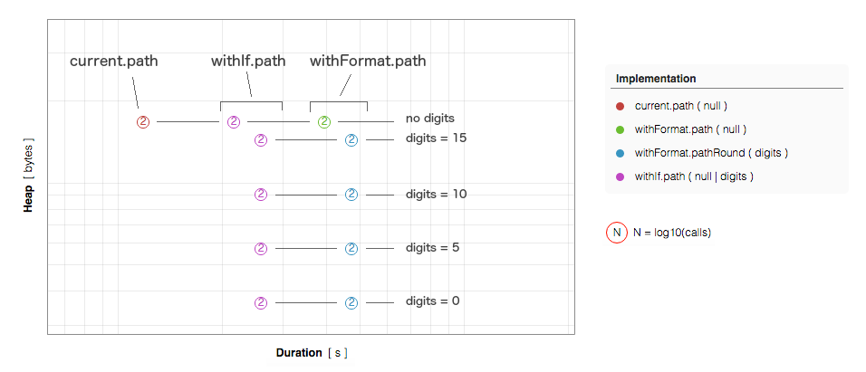
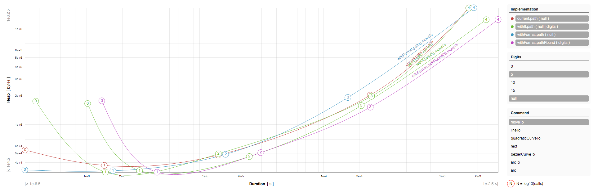

# d3 benchmarks

Quick repo to support the discussion in [this d3-path issue](https://github.com/d3/d3-path/issues/10).

## Installation

- `npm install`
- `npm run build` (always run this after modifying files in `src/implementations`)

## Benches

### path

This bench compares different implementations of d3's `path`, saving:
- **execution time**,
- **heap memory** used by the instance of `path` after running a command (`moveTo`, etc) `N` times.

Run with: `npm run path`.

#### Implementations of `d3.path()`

- [current](https://github.com/d3/d3-path/blob/master/src/path.js): official version
- [withFormat](https://github.com/mindrones/d3-benchmarks/blob/master/src/path/withFormat.js):

  - `pathCoerceFixed`: input value coercion to a number and truncation via `.toFixed()` (copied from [this PR](https://github.com/d3/d3-path/blob/fixed/src/path.js) and renamed `pathFixed` -> `pathCoerceFixed` as we use `pathFixed` with no input value coercion):

    ```js
    export function pathCoerceFixed(digits) {
        var path = new Path;
        (digits = +digits).toFixed(digits); // Validate digits.
        path._format = function(x) { return +x.toFixed(digits); };
        return path;
    }
    ```

  - `pathFixed`: similar to the previous one without input value coercion, truncation via `.toFixed()`:

    ```js
    export function pathFixed(digits) {
        var path = new Path;
        (digits = +digits).toFixed(digits); // Validate digits.
        path._format = function(x) { return x.toFixed(digits); };
        return path;
    }
    ```

  - `pathCoerceRound`: input value coercion to a number and truncation via [round](https://github.com/d3/d3-format/issues/32):

    ```js
    import {round} from '../utils/round'
    export function pathCoerceRound(digits) {
        var path = new Path;
        (digits = +digits).toFixed(digits); // Validate digits.
        path._format = function(x) { return round(+x, digits); };
        return path;
    }
    ```

  - `pathRound`: no input value coercion and truncation via same `round` as above:

    ```js
    export function pathRound(digits) {
      var path = new Path;
      digits = +digits).toFixed(digits); // Validate digits.
      path._format = function(x) { return round(x, digits); };
      return path;
    }
    ```

- [withIf](https://github.com/mindrones/d3-benchmarks/blob/master/src/path/withIf.js): instead of using a `format()` function, use `if`s and round if we provided `digits`:
  ```js
  import {round as R} from '../utils/round'

  // ...
  moveTo: function(x, y) {
    if (this._d) {
      this._ += `M${R(this._x0 = this._x1 = x, this._d)},${R(this._y0 = this._y1 = y, this._d)}`;
    } else {
      this._ += `M${this._x0 = this._x1 = x},${this._y0 = this._y1 = y}`;
    }
  },
  ```
  This implementation duplicates code, so if the case we could test assigning values to temporary vars like this:
  ```js
  moveTo: function(x, y) {
    this._x0 = this._x1 = this._d ? R(x, this._d) : x
    this._y0 = this._y1 = this._d ? R(y, this._d) : y
    this._ += `M${this._x0},${this._y0}`;
  },
  ```

#### Results

Results are saved in `./data/path.json` as a list of objects like:

```js
{
  "impl": "path.current.path",
  "digits": null,
  "command": "moveTo",
  "calls": 1,
  "heap": 46464.64,
  "duration": 3.170281801295085e-7
}
```

- `impl`: name of the implementation
- `digits`: digits we passed to `path()`
- `command`: executed path command ('moveTo', 'lineTo', etc)
- `calls`: how many times we invoked the command on the path instance `p`
- `heap`: heap memory used by the `p` instance after calling the `coommand` `calls` times, in bytes
- `duration`: mean test execution time, in seconds

**You can explore the results with this [interactive chart](https://mindrones.github.io/d3-benchmarks/)**

#### How to interpret results

Ideally, for a given amount of calls of a certain command (i.e. '3 calls of `moveTo`' meaning `p.moveTo(N,N).moveTo(N,N).moveTo(N,N)`), we should expect this kind of results:



This is because calling a command with no digits always returns the same path string, the longest possible, no matter the chosen implementation, while passing values of `digits` lower than the maximum precision allowed by the platform (see [Number.EPSILON](https://developer.mozilla.org/en-US/docs/Web/JavaScript/Reference/Global_Objects/Number/EPSILON)) shortens the returned path string.

For example, assuming `N = 10.1234567890123456` (16 digits):

- `withFormat.path().moveTo(N,N)        => "M10.1234567890123456,10.1234567890123456"`
- `withFormat.pathRound(15).moveTo(N,N) => "M10.123456789012346,10.123456789012346"`
- `withFormat.pathRound(10).moveTo(N,N) => "M10.1234567890,10.1234567890"`
- `withFormat.pathRound(5).moveTo(N,N)  => "M10.12346,10.12346"`
- `withFormat.pathRound(0).moveTo(N,N)  => "M10,10"`

Hence, decreasing digits should lower the used heap as the instance of path has to store a shorter string, but rounding the input value should increase the execution time.

Here's an example of we what get in practice:



### round

Compare two rounding functions and `.toFixed()`, also coercing the input (be it a number or a string) to a number, to check the coercion impact on speed.

Tested implementations:

  - [mbostock's round](https://github.com/d3/d3-format/issues/32)
  - [MDN php-like round](https://developer.mozilla.org/en-US/docs/Web/JavaScript/Reference/Global_Objects/Math/round#PHP-Like_rounding_Method)

Run with: `npm run round`.

Results are saved in `./data/rounding.json` as a list of objects like:

```js
{
  "impl": "round",
  "transform": null,
  "digits": 0,
  "duration": 1.5478552534985366e-8
},
```

- `impl`: name of the rounding implementation
- `transform`: input coercion
  - null: no coercion
  - 'CoerceNumber': `+N`
  - 'CoerceString': `+(N.toString())`
- `digits`: digits we passed to the rounding function
  - `round(N, digits)`,
  - `roundMDN(N, digits)`,
  - `N.toFixed(digits)`
- `duration`: mean test execution time, in seconds
